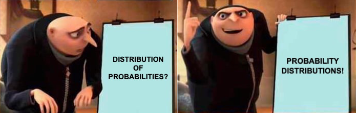
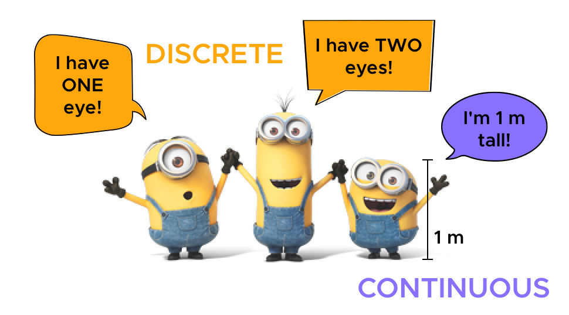
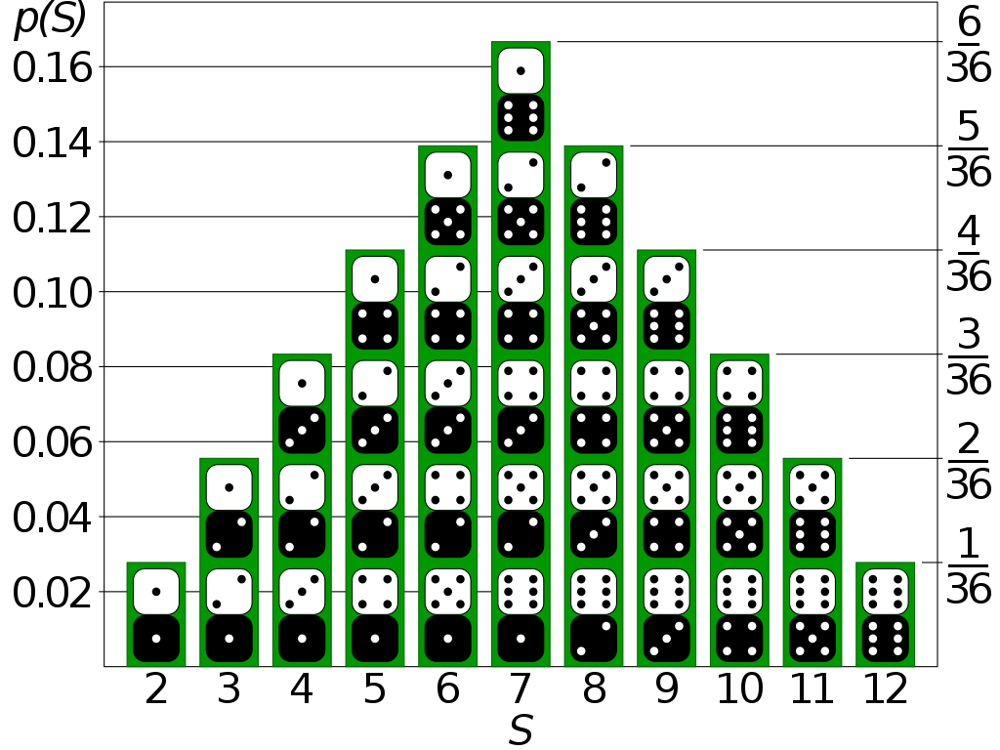
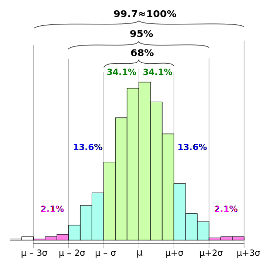

```{r setup, include=FALSE}
options(htmltools.dir.version = FALSE)
library(tidyverse)
theme_set(theme_minimal())
```

class: middle

.pull-left[

]

.pull-right[

]

???

We are faced every day with probabilities. Just think about the weather forecast.

There is a 70% prob that it will rain today. Prob of an event occurring.

What about complex events? => list of probs.

(I might want to introduce random variables here... with an extra slide)

---

# Grubabilities

&nbsp;

.center[

]

???

Lists of probs are probability distributions.

A list of values with corresponding probability.

---

# Discrete and continuous

.center[

]

???

Depending on the nature of the values a variable can take, there are 2 types of probs.


---

# Discrete probability distributions

.center[

]

???

Counting as probability. Fractions as probability.

---

# Discrete probability distributions

```{r discs-p, echo=FALSE, fig.width=7, fig.height=4, out.width="800px", fig.retina=2, fig.align="center"}
x <- seq(0, 10)
y <- dpois(x, 3)
ggplot() +
  aes(x, y) +
  geom_point(size = 5) +
  geom_linerange(aes(xmin = x, xmax = x, ymin = 0, ymax = y), size = 2) +
  scale_x_continuous(n.breaks = 10) +
  labs(
    x = "Count", y = "Density",
    title = "Poisson distribution",
    subtitle = expression(paste(lambda, "=3"))
  )
```

---

# Continuous probability distributions

```{r cont-p, echo=FALSE, fig.width=7, fig.height=4, out.width="800px", fig.retina=2, fig.align="center"}
x <- seq(0, 400)
ggplot() +
  aes(x = x, y = dnorm(x, 200, 50)) +
  geom_line(size = 2) +
  labs(
    x = "f0 (Hz)", y = "Density",
    title = "Gaussian distribution",
    subtitle = expression(paste(mu, "=200", ", ", sigma, "=50"))
  )
```

???

With cont probs we cannot count for all possible values (0.0, 0.00, 0.000, 0.000...) and we cannot assign a prob to any specific value.

Instead we can assign a prob to a range of values.

---

# Continuous probability distributions

```{r cont-p-2, echo=FALSE, fig.width=7, fig.height=4, out.width="800px", fig.retina=2, fig.align="center"}
x <- seq(0, 400)
y = dnorm(x, 200, 50)
ggplot() +
  aes(x, y) +
  geom_ribbon(aes(x = ifelse(x < 160 , x, NA), ymin = 0, ymax = y), alpha = 0.5, fill = "#FFA70B") +
  geom_line(size = 2) +
  labs(
    x = "f0 (Hz)", y = "Density",
    title = "Gaussian distribution",
    subtitle = expression(paste(mu, "=200", ", ", sigma, "=50"))
  )
```

---

# Continuous probability distributions

```{r cont-p-3, echo=FALSE, fig.width=7, fig.height=4, out.width="800px", fig.retina=2, fig.align="center"}
x <- seq(0, 400)
y = dnorm(x, 200, 50)
ggplot() +
  aes(x, y) +
  geom_ribbon(aes(x = ifelse(x > 220 , x, NA), ymin = 0, ymax = y), alpha = 0.5, fill = "#FFA70B") +
  geom_line(size = 2) +
  labs(
    x = "f0 (Hz)", y = "Density",
    title = "Gaussian distribution",
    subtitle = expression(paste(mu, "=200", ", ", sigma, "=50"))
  )
```

---

# Continuous probability distributions

```{r cont-p-4, echo=FALSE, fig.width=7, fig.height=4, out.width="800px", fig.retina=2, fig.align="center"}
x <- seq(0, 400)
y = dnorm(x, 200, 50)
ggplot() +
  aes(x, y) +
  geom_ribbon(aes(x = ifelse(x > 120 & x < 210 , x, NA), ymin = 0, ymax = y), alpha = 0.5, fill = "#FFA70B") +
  geom_line(size = 2) +
  labs(
    x = "f0 (Hz)", y = "Density",
    title = "Gaussian distribution",
    subtitle = expression(paste(mu, "=200", ", ", sigma, "=50"))
  )
```


---

# Continuous probability distributions

```{r cont-p-5, echo=FALSE, fig.width=7, fig.height=4, out.width="800px", fig.retina=2, fig.align="center"}
x <- seq(0, 1, by = 0.01)
y = dbeta(x, 2, 5)
ggplot() +
  aes(x, y) +
  geom_vline(xintercept = c(0, 1), colour = "grey") +
  geom_ribbon(aes(x, ymin = 0, ymax = y), alpha = 0.5, fill = "#FFA70B") +
  geom_line(size = 2) +
  labs(
    x = "f0 (Hz)", y = "Density",
    title = "Beta distribution",
    subtitle = expression(paste(alpha, "=2", ", ", beta, "=5"))
  )
```

???

There are many other types of cont prob distrs.

The beta is one of them. It's bounded between 0 and 1, used for proportions, percentages.

---

# Describing probabilities

[embed seeing theory prob distr normal]


???

But how do we describe prob distrs? We can't make a list of all values and probs.

Instead, we specify the value of a few parameters that describe the distribution in a succinct way.

(The example from seeing theory shows that with different values you get different "shapes")

---
class: middle

<span style="font-size:3.5em;">$$y_i \sim Normal(\mu, \sigma)$$</span>

???

(Here I explain the simple formula of a Gauss distr.)

---
class: middle

<span style="font-size:3.5em;">$$\text{f0}_i \sim Normal(200, 50)$$</span>

???

(While here I give a real-world example: with f0.)

---
class: center middle

```{r norm, echo=FALSE}
x <- seq(0, 400)
ggplot() +
  aes(x = x, y = dnorm(x, 200, 50)) +
  geom_line()
```

???

Nothing new here. Just a distribution as we've seen before.

(Show them how that looks like.)

---

# Memory loss

.center[

]

<span style="font-size:10pt;">https://thinking.umwblogs.org/2020/02/26/goldfish-memory/</span>

???

Freq stats forgets about the past (memory loss).

Another important component of Bayesian analysis is prior knowledge (you've seen that in B theorem).

We can take prior knowledge or belief into consideration in what is called "Bayesian belief update".

---

# Bayesian belief update

.center[

]

???

How do we ensure that prior knowledge is not lost?

You've seen in 01 that Bayesian analysis is about estimating the post distr of the variable of interest.

The post distr is (roughly) the combination of the prior belief and the evidence derived from the data (remember Bayes Theorem).

Both prior and evidence are probability distributions.

---

[embed seeing theory bayesian update]

---

# Prior belief as probability distributions

&nbsp;

<span style="font-size:3em;">$$\text{art_rate}_i \sim Normal(\mu, \sigma)$$</span>

???

Our prior belief about articulation rate is that it is distributed according to a Normal (aka Gaussian) distr.

The Normal has two parameters: mean, SD.

Here we are trying to estimate these parameters.

---

# Prior belief as probability distributions

<span style="font-size:3em;">$$\text{art_rate}_i \sim Normal(\mu, \sigma)$$</span>

<span style="font-size:3em;">$$\mu = ...?$$</span>

???

We do have an idea of what the mean could be like but we are not certain.

When you are not certain, you make a list of values and their prob, i.e. a prob distr!

---

# Prior belief as probability distributions

<span style="font-size:3em;">$$\text{art_rate}_i \sim Normal(\mu, \sigma)$$</span>

<span style="font-size:3em;">$$\mu \sim Normal(\mu_1, \sigma_1)$$</span>

???

Usually, we assume the mean to be a value taken from another Normal distribution (with its mean and SD).

This Normal is the prior probability distribution (or simply prior) of the mean.

---

# Prior probability distribution

<span style="font-size:3em;">$$\text{art_rate}_i \sim Normal(\mu, \sigma)$$</span>

<span style="font-size:3em;">$$\mu \sim Normal(0, \sigma_1)$$</span>

???

We will talk about types of priors later. For now it's sufficient to remember that a conservative approach (which is what we want) is to set $\mu_1$ to 0.

What about $\sigma_1$?

---

# 68–95–99.7 rule

.center[

]
???

As a general rule, plus/minus two times the SD ($\sigma_1$) covers 95% of the distribution, which means we are 95% confident that the value lies within that range.

Let's be generous and assume that the mean articulation rate will not be greater than 20 syls per sec.

20/2 = 10 (remember, two times the SD), so we can set $\sigma_1$ to 10.

---

# Seeing is believing

```{r prior-1, echo=FALSE, fig.width=7, fig.height=4, out.width="800px", fig.retina=2, fig.align="center"}
x <- seq(-40, 40)
ggplot() +
  aes(x = x, y = dnorm(x, 0, 10)) +
  geom_line(size = 2) +
  labs(
    x = "f0 (Hz)", y = "Density",
    title = expression(paste("Prior for ", sigma)),
    subtitle = expression(paste(mu[1], "=0", ", ", sigma[1], "=10"))
  )
```

???

Visualising priors is important, because it's easier to grasp its meaning when you can actually see the shape of the distribution.

We will see more about priors and how to visualise them tomorrow.

---

class: inverse center middle

# LIVE CODING
