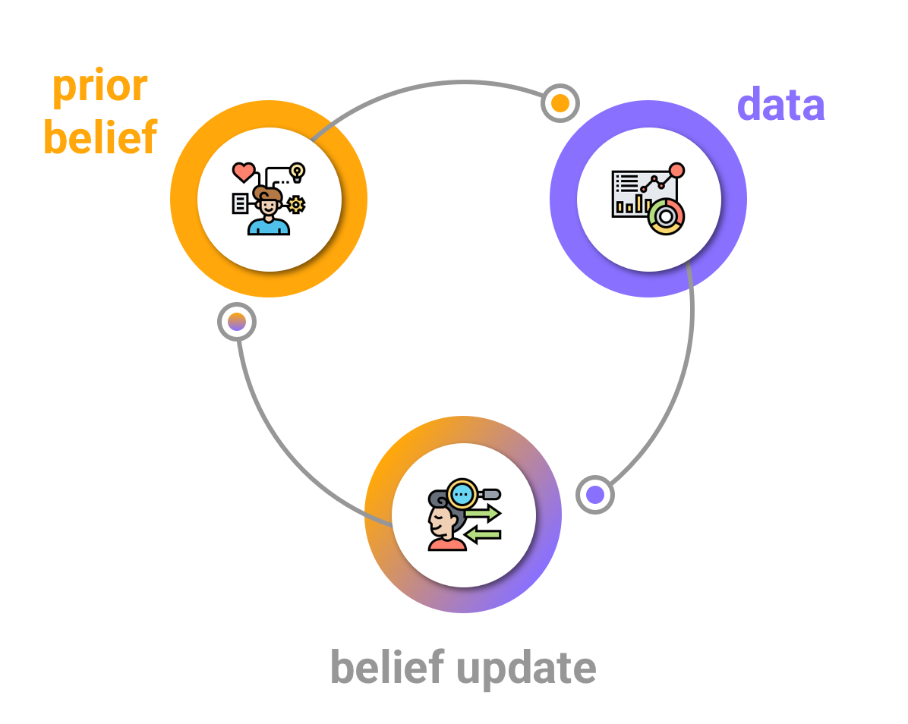

```{r setup, include=FALSE}
options(htmltools.dir.version = FALSE)
library(tidyverse)
theme_set(theme_minimal())
```

class: middle

.pull-left[

]

.pull-right[

]

???

We are faced every day with probabilities. Just think about the weather forecast.

We say things like t"here is a 70% prob that it will rain today". In this sense, probability is the probability of an event occurring.

But what about more complex situations that are not a flip-of-coin kinda situation? For example what about rolling two dice?

Here is where probability distributions come in.

---

# Grubabilities

&nbsp;

.center[

]

???

A probability distribution is a list of values and their corresponding probability.

---

# Discrete and continuous

.center[

]

???

Depending on the nature of the values a variable can take, there are 2 types of probs.


---

# Discrete probability distributions

.center[

]

???


A discrete probability distributions is like counting how many ways you can get a particular value.

For example, if you roll a white and a black dice, there are 3 ways to get a 4 or a 10, but 6 ways to get a 7.

---

# Discrete probability distributions

```{r discs-p, echo=FALSE, fig.width=7, fig.height=4, out.width="800px", fig.retina=2, fig.align="center"}
x <- seq(0, 10)
y <- dpois(x, 3)
ggplot() +
  aes(x, y) +
  geom_point(size = 5) +
  geom_linerange(aes(xmin = x, xmax = x, ymin = 0, ymax = y), size = 2) +
  scale_x_continuous(n.breaks = 10) +
  labs(
    x = "Count", y = "Density",
    title = "Poisson distribution",
    subtitle = expression(paste(lambda, "=3"))
  )
```

???

The Poisson is the probability distribution of counts (like counting eyes, number of fillers in speech, etc).

---

# Continuous probability distributions

```{r cont-p, echo=FALSE, fig.width=7, fig.height=4, out.width="800px", fig.retina=2, fig.align="center"}
x <- seq(0, 400)
ggplot() +
  aes(x = x, y = dnorm(x, 200, 50)) +
  geom_line(size = 2) +
  labs(
    x = "f0 (Hz)", y = "Density",
    title = "Gaussian distribution",
    subtitle = expression(paste(mu, "=200", ", ", sigma, "=50"))
  )
```

???

With continuous probabilities we cannot make a list of all the possible values (0.0, 0.00, 0.000, 0.0001...), because there is an infinite number of possible values. So we cannot assign a probability to a specific value.

Instead, we assign probabilities to a range of values.

---

# Continuous probability distributions

```{r cont-p-2, echo=FALSE, fig.width=7, fig.height=4, out.width="800px", fig.retina=2, fig.align="center"}
x <- seq(0, 400)
y = dnorm(x, 200, 50)
ggplot() +
  aes(x, y) +
  geom_ribbon(aes(x = ifelse(x < 160.0001 , x, NA), ymin = 0, ymax = y), alpha = 0.5, fill = "#FFA70B") +
  geom_line(size = 2) +
  scale_x_continuous(breaks = c(0, 100, 160, 200, 300, 400)) +
  labs(
    x = "f0 (Hz)", y = "Density",
    title = "Gaussian distribution",
    subtitle = expression(paste(mu, "=200", ", ", sigma, "=50"))
  )
```

???

In this example, we want to know the probability of getting a mean f0 between 0 and 160 Hz.

We simply calculate the area under the curve between those two values (the total area under the curve is 1).

The probability of f0 being less than 160 Hz is `r round(pnorm(160, 200, 50), digits = 3)`.

---

# Continuous probability distributions

```{r cont-p-3, echo=FALSE, fig.width=7, fig.height=4, out.width="800px", fig.retina=2, fig.align="center"}
x <- seq(0, 400)
y = dnorm(x, 200, 50)
ggplot() +
  aes(x, y) +
  geom_ribbon(aes(x = ifelse(x > 219.999 , x, NA), ymin = 0, ymax = y), alpha = 0.5, fill = "#FFA70B") +
  geom_line(size = 2) +
  scale_x_continuous(breaks = c(0, 100, 200, 220, 300, 400)) +
  labs(
    x = "f0 (Hz)", y = "Density",
    title = "Gaussian distribution",
    subtitle = expression(paste(mu, "=200", ", ", sigma, "=50"))
  )
```

???

The probability of f0 being greater than 220 Hz is `r round(pnorm(220, 200, 50, lower.tail = FALSE), digits = 3)`.

---

# Continuous probability distributions

```{r cont-p-4, echo=FALSE, fig.width=7, fig.height=4, out.width="800px", fig.retina=2, fig.align="center"}
x <- seq(0, 400)
y = dnorm(x, 200, 50)
ggplot() +
  aes(x, y) +
  geom_ribbon(aes(x = ifelse(x > 119.999 & x < 210.001 , x, NA), ymin = 0, ymax = y), alpha = 0.5, fill = "#FFA70B") +
  geom_line(size = 2) +
  scale_x_continuous(breaks = c(0, 100, 120, 200, 210, 300, 400)) +
  labs(
    x = "f0 (Hz)", y = "Density",
    title = "Gaussian distribution",
    subtitle = expression(paste(mu, "=200", ", ", sigma, "=50"))
  )
```

???

The probability of f0 being between 120 and 210 Hz is `r round(pnorm(210, 200, 50) - pnorm(120, 200, 50), digits = 3)`

---

# Continuous probability distributions

```{r cont-p-5, echo=FALSE, fig.width=7, fig.height=4, out.width="800px", fig.retina=2, fig.align="center"}
x <- seq(0, 1, by = 0.01)
y = dbeta(x, 2, 5)
ggplot() +
  aes(x, y) +
  geom_vline(xintercept = c(0, 1), colour = "grey") +
  geom_ribbon(aes(x, ymin = 0, ymax = y), alpha = 0.5, fill = "#FFA70B") +
  geom_line(size = 2) +
  labs(
    x = "f0 (Hz)", y = "Density",
    title = "Beta distribution",
    subtitle = expression(paste(alpha, "=2", ", ", beta, "=5"))
  )
```

???

There are many other types of continuous probability distributions

This is the beta distribution. It's bounded between 0 and 1, and it's used for example with proportions and percentages (which can take on any value between 0-1 and 0-100%).

---

class: middle

<iframe src="https://seeing-theory.brown.edu/probability-distributions/index.html#section2" style="border:none;" width="100%" height="100%">

???

But how do we describe probability distributions? We can't make a list of all values and probabilities, especially for continuous probabilities.

Instead, we specify the value of a few parameters that describe the distribution in a succinct way.

---
class: middle

<span style="font-size:3.5em;">$$y_i \sim Normal(\mu, \sigma)$$</span>

???

Let's look at some formulas.

This is the formula of a variable $y_1$ that is distributed according to (~) a Normal probability distribution.

As we have seen in the example above, a Normal distribution can be described with two parameters: the mean and the standard deviation.

---
class: middle

<span style="font-size:3.5em;">$$\text{f0}_i \sim Normal(200, 50)$$</span>

???

Remember the example above of a Gaussian/Normal distribution of f0?

We can describe that distribution with this formula (much easier than listing all the values and their probability).

---

class: center middle

```{r f0-prior, echo=FALSE, fig.width=7, fig.height=4, out.width="800px", fig.retina=2, fig.align="center"}
x <- seq(0, 400)
ggplot() +
  aes(x = x, y = dnorm(x, 200, 50)) +
  geom_line(size = 2) +
  labs(
    x = "f0 (Hz)", y = "Density",
    title = "Distribution of mean f0",
    subtitle = expression(paste(mu, "=200", ", ", sigma, "=50"))
  )
```

???

Nothing new here. Just the distribution as we've seen before.

---

class: inverse center bottom
background-image: url("img/chris-robert-unsplash.jpg")

# BREAK

---

# Memory loss

.center[

]

<span style="font-size:10pt;">https://thinking.umwblogs.org/2020/02/26/goldfish-memory/</span>

???

Frequentist statistics suffers from "memory loss": results of past studies are "forgotten".

One important aspect of Bayesian analysis is prior knowledge (you've seen that with the Bayes theorem).

We can take prior knowledge, or belief, into consideration thanks to "Bayesian belief updating".

---

# Bayesian belief update

.center[

]

???

How do we ensure that prior knowledge is not lost?

You've seen in Session 01 that Bayesian analysis is about estimating the posterior probability distribution of a variable of interest.

Roughly speaking, the posterior probability distribution is the combination of the prior belief and the evidence derived from the data.

Prior and evidence are, of course, probability distributions.

---

class: middle

<iframe src="https://seeing-theory.brown.edu/bayesian-inference/index.html#section3" style="border:none;" width="100%" height="100%">

---

# Prior belief as probability distributions

&nbsp;

<span style="font-size:3em;">$$\text{articulation_rate}_i \sim Normal(\mu, \sigma)$$</span>

???

Our prior belief about articulation rate is that it is distributed according to a Normal (aka Gaussian) distribution.

The Normal distribution has two parameters: mean $\mu$ and standard deviation $\sigma$.

Now, we want to estimate these two parameters from the data.

---

# Prior belief as probability distributions

<span style="font-size:2.5em;">$$\text{articulation_rate}_i \sim Normal(\mu, \sigma)$$</span>

<span style="font-size:2.5em;">$$\mu = ...?$$</span>

???

We do have an idea of what the mean articulation rate could be like but we are not certain.

When you are not certain, you make a list of values and their probability, i.e. a probability distribution!

---

# Prior belief as probability distributions

<span style="font-size:2.5em;">$$\text{articulation_rate}_i \sim Normal(\mu, \sigma)$$</span>

<span style="font-size:2.5em;">$$\mu \sim Normal(\mu_1, \sigma_1)$$</span>

???

Usually, we assume the mean to be a value taken from another Normal distribution (with its own mean and SD).

This Normal distribution is the **prior probability distribution** (or simply prior) of the mean.

---

# Prior belief as probability distributions

<span style="font-size:2.5em;">$$\text{articulation_rate}_i \sim Normal(\mu, \sigma)$$</span>

<span style="font-size:2.5em;">$$\mu \sim Normal(0, \sigma_1)$$</span>

???

We will talk about different types of priors later. For now it's sufficient to remember that a conservative approach (which is what we want to do) is to set $\mu_1$ to 0.

--

<span style="font-size:2.5em;">$$\sigma_1 = ...?$$</span>

???

What about $\sigma_1$?

---

# The empirical rule


```{r empirical-rule, echo=FALSE, fig.width=7, fig.height=4, out.width="800px", fig.retina=2, fig.align="center"}
x <- seq(-4, 4, by = 0.01)
y = dnorm(x, 0, 1)
ggplot() +
  aes(x, y) +
  geom_ribbon(aes(x = x, ymin = 0, ymax = y), alpha = 0.3, fill = "#8970FF") +
  geom_ribbon(aes(x = ifelse(x >= -2 & x <= 2, x, NA), ymin = 0, ymax = y), alpha = 0.4, fill = "#8970FF") +
  geom_ribbon(aes(x = ifelse(x >= -1 & x <= 1, x, NA), ymin = 0, ymax = y), alpha = 0.7, fill = "#8970FF") +
  geom_line(size = 2, colour = "#FFA70B") +
  annotate(
    "segment",
    x = -1, xend = 1, y = 0.45, yend = 0.45,
    arrow = arrow(ends = "both", angle = 90, length = unit(.2, "cm")),
    size = 1
  ) +
  annotate("label", x = 0, y = 0.45, label = "68%") +
  annotate(
    "segment",
    x = -2, xend = 2, y = 0.5, yend = 0.5,
    arrow = arrow(ends = "both", angle = 90, length = unit(.2, "cm")),
    size = 1
  ) +
  annotate("label", x = 0, y = 0.50, label = "95%") +
  annotate(
    "segment",
    x = -3, xend = 3, y = 0.55, yend = 0.55,
    arrow = arrow(ends = "both", angle = 90, length = unit(.2, "cm")),
    size = 1
  ) +
  annotate("label", x = 0, y = 0.55, label = "99.7 ≈ 100%") +
  scale_x_continuous(breaks = c(-4:4), labels = c("", expression(paste(-3, sigma)), expression(paste(-2, sigma)), expression(paste(-1, sigma)), expression(paste(mu)), expression(paste(+1, sigma)), expression(paste(+2, sigma)), expression(paste(+3, sigma)), "")) +
  labs(
    x = element_blank(), y = element_blank()
  )
```

???

As a general rule, $\pm2\sigma_1$ covers 95% of the Normal distribution, which means we are 95% confident that the value lies within that range.

Let's be generous and assume that the mean articulation rate will definitely not be greater than 30 syllables per second. (This might seem like a very high number, but we will see tomorrow how it can help estimation)

30/2 = 15 (remember, two times the SD), so we can set $\sigma_1 = 15$.

---

# Seeing is believing

```{r prior-1, echo=FALSE, fig.width=7, fig.height=4, out.width="800px", fig.retina=2, fig.align="center"}
x <- seq(-60, 60)
ggplot() +
  aes(x = x, y = dnorm(x, 0, 15)) +
  geom_line(size = 2, colour = "#8970FF") +
  labs(
    x = "Articulation rate (syl/s)", y = "Density",
    title = expression(paste("Prior for ", mu)),
    subtitle = expression(paste(mu[1], "=0", ", ", sigma[1], "=15"))
  )
```

???

Visualising priors is important, because it's easier to grasp its meaning when you can actually see the shape of the distribution.

Are you wondering about the negative values? (Articulation rate cannot be negative!) I will tell more about this and how to "fix" it tomorrow.

---

class: inverse center middle
background-image: url("img/code-matrix.jpg")

# <span style="font-size:3em;">LIVE CODING</span>

---

# And $\sigma$?

<span style="font-size:2.5em;">$$\text{articulation_rate}_i \sim Normal(\mu, \sigma)$$</span>

<span style="font-size:2.5em;">$$\mu \sim Normal(0, 15)$$</span>

<span style="font-size:2.5em;">$$\sigma = ...?$$</span>

???

Now, what about $\sigma$? (Be careful not to mix up $\sigma$ and $\sigma_1$! This is $\sigma$ from the first line, not $sigma_1$ from the second line).

---

class: bottom inverse

background-image: url("img/matt-walsh-unsplash.jpg")

# <span style="font-size:3em;">EXERCISE</span>

???

Find out in the exercise!

Run `open_exercise(3)` in the console to open the exercise.
