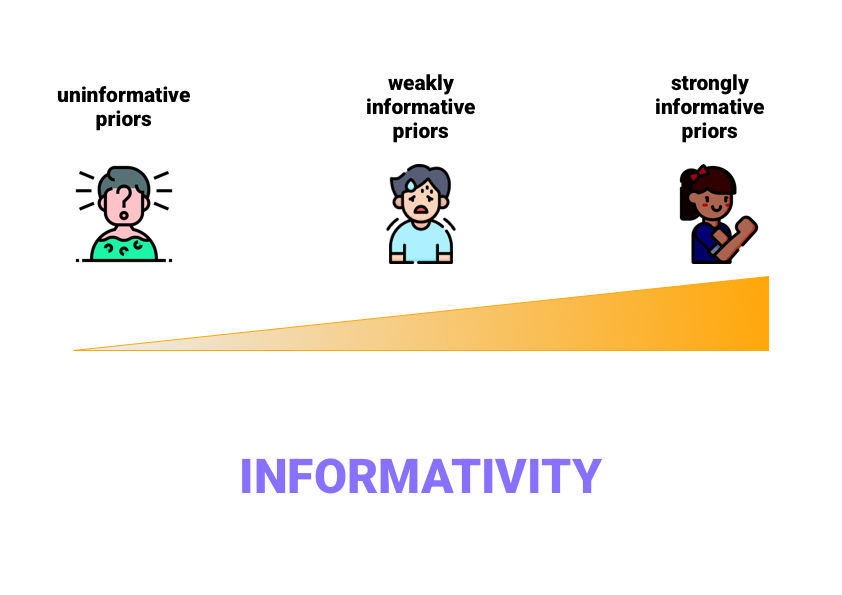

```{r setup, include=FALSE}
options(htmltools.dir.version = FALSE)
library(tidyverse)
theme_set(theme_minimal())
library(brms)
library(learnB4SS)
data("polite")
```

```{r xaringanExtra, echo=FALSE}
xaringanExtra::use_xaringan_extra(c("tachyons"))
```

class: center middle


???

Priors can convey different amounts of prior knowledge, or information. This is called "informativity".

---

class: center middle


???

Informativity is a scale: from the least to the greatest amount of information.

Note that the scale is relative, not absolute.

---

class: center middle



???

Based on the scale, we can identify three types of priors:

- Uninformative priors: virtually no prior knowledge/information is added to the model. These are also called "flat" priors, because the distribution is flat (all values have the same probability). No influence on the posterior.

- Weakly informative priors: some prior knowledge/information is added to the model, but it is vague or at least less informative than what the actual prior knowledge is.

- Strongly informative priors: most or all of the prior knowledge/information is added to the model. This have the strongest influence on the posterior.

---

# Prior informativity

```{r f0-prior, echo=FALSE, fig.width=7, fig.height=4, out.width="800px", fig.retina=2, fig.align="center"}
x <- seq(-200, 600)
y_1 <- dnorm(x, 200, 100)
y_2 <- dnorm(x, 200, 50)
y_3 <- dnorm(x, 200, 20)

ggplot() +
  aes(x) +
  geom_hline(aes(yintercept = 0.004, colour = "orange"), size = 1.5, linetype = "dashed") +
  geom_line(aes(y = y_1, colour = "#cbc9e2"), size = 1.5) +
  geom_line(aes(y = y_2, colour = "#9e9ac8"), size = 1.5) +
  geom_line(aes(y = y_3, colour = "#6a51a3"), size = 1.5) +
  labs(
    x = "f0 (Hz)", y = "Density",
    title = "Prior of the mean f0"
  ) +
  scale_color_identity(guide = "legend", name = "Informativity", labels = c("very strong", "strong", "weak", "none"))
```

???

Examples of priors with different degrees of informativity in relation to the mean f0.


---

class: center middle


???

Regularising priors are priors centered on 0 (i.e. with mean = 0). These priors are help with model estimation and safe-guard against extreme effects.

---

by [Kristoffer Magnusson](https://rpsychologist.com/)

<iframe src="https://rpsychologist.com/d3/bayes/" style="border:none;" width="100%" height="80%">

???

Here we can visualise the effect of the prior on the posterior.

---

# Recommendations

.bg-washed-blue.b--black.ba.bw2.br3.shadow-5.ph4.mt2[
Use **regularising priors**.

- Prior mean = 0.
]

.bg-washed-blue.b--black.ba.bw2.br3.shadow-5.ph4.mt2[
Use **weakly informative priors**.

- Prior standard deviation as large as it makes sense.
]

---

# Prior predictive checks

```{r prior-pred-checks, eval=TRUE}
my_priors <- c(
  prior(normal(0, 15), class = Intercept),
  prior(normal(0, 10), class = b, coef = attitudepol),
  prior(cauchy(0, 1), class = sigma)
)

b_mod_01_pripc <- brm(
  articulation_rate ~ attitude,
  prior = my_priors,
  sample_prior = "only",
  data = polite,
  file = here::here("assets/b_mod_01_pripc")
)
```

???

When choosing priors it's important to check that they are weakly informative enough, but not too weakly informative.

You can run prior predictive checks using the same code as you would use when fitting the model, but with the argument `sample_prior = "only"`.

This code will run the model sampling values from the priors.

---

# Prior predictive checks

```{r prior-pred-checks-plot, eval=TRUE, fig.width=7, fig.height=4, out.width="800px", fig.retina=2, fig.align="center"}
conditional_effects(b_mod_01_pripc)
```

???

You can now plot the model predictions based on the priors with `conditional_effects()`. (You can use this function with a full model too!)

Remember yesterday we were wondering about negative values (articulation rate cannot be negative)? That is because, in fact, articulation rate does not follow a normal/Gaussian distribution.

Instead, we can use a log-normal distribution as the family of the outcome variable.

---

# BRM with non-Gaussian distributions

```{r prior-pred-checks-log-normal, eval=TRUE}
my_priors <- c(
  prior(normal(0, 3), class = Intercept),
  prior(normal(0, 1), class = b, coef = attitudepol),
  prior(cauchy(0, 0.1), class = sigma)
)

b_mod_02_pripc <- brm(
  articulation_rate ~ attitude,
  prior = my_priors,
  sample_prior = "only",
  data = polite,
  family = lognormal(),
  file = here::here("assets/b_mod_02_pripc")
)
```

???

This is just a quick example with `family = lognormal()`. Note that priors have to be specified on the log-scale and that the posterior will also be on the log scale.

Unfortunately we don't have time to go into details (it would need a workshop on its own!), but if you used logistic regressions before, you can use your knowledge to set priors and interpret the model output.

The same concepts we covered with priors for `family = gaussian()` apply to other distributions.

---

# BRM with non-Gaussian distributions

```{r prior-pred-checks-log-normal-plot, eval=TRUE, fig.width=7, fig.height=4, out.width="800px", fig.retina=2, fig.align="center"}
conditional_effects(b_mod_02_pripc)
```

