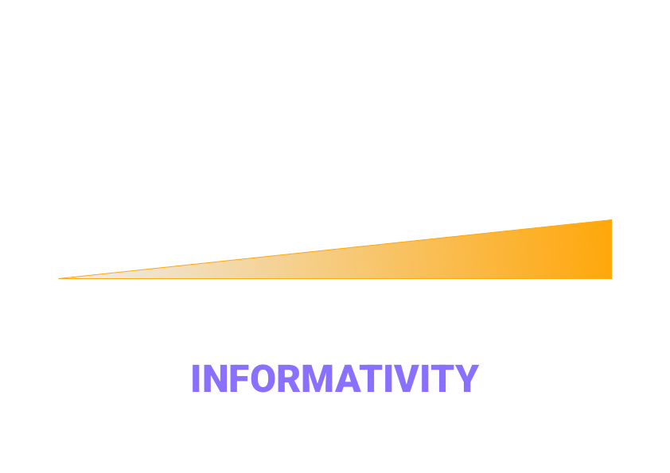
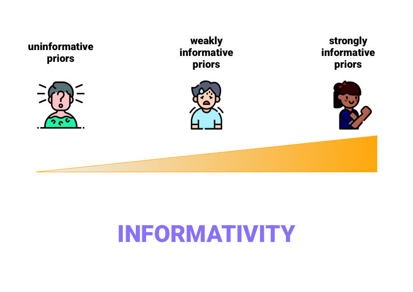

```{r setup, include=FALSE}
options(htmltools.dir.version = FALSE)
library(tidyverse)
theme_set(theme_minimal())
```

```{r xaringanExtra, echo=FALSE}
xaringanExtra::use_xaringan_extra(c("tachyons"))
```


---


---



---



---

# Prior informativity

```{r f0-prior, echo=FALSE, fig.width=7, fig.height=4, out.width="800px", fig.retina=2, fig.align="center"}
x <- seq(-200, 600)
y_1 <- dnorm(x, 200, 100)
y_2 <- dnorm(x, 200, 50)
y_3 <- dnorm(x, 200, 20)

ggplot() +
  aes(x) +
  geom_hline(aes(yintercept = 0.004, colour = "orange"), size = 1.5, linetype = "dashed") +
  geom_line(aes(y = y_1, colour = "#cbc9e2"), size = 1.5) +
  geom_line(aes(y = y_2, colour = "#9e9ac8"), size = 1.5) +
  geom_line(aes(y = y_3, colour = "#6a51a3"), size = 1.5) +
  labs(
    x = "f0 (Hz)", y = "Density",
    title = "Prior of the mean f0"
  ) +
  scale_color_identity(guide = "legend", name = "Informativity", labels = c("very strong", "strong", "weak", "none"))
```


---


---

# Regularising priors

by Nan Xiao | 肖楠

<iframe src="https://nanx.shinyapps.io/conjugate-normal-umkv/" style="border:none;" width="100%" height="80%">

---

# Recommendations

.bg-washed-blue.b--black.ba.bw2.br3.shadow-5.ph4.mt2[
Use **regularising priors**.

- Prior mean = 0.
]

.bg-washed-blue.b--black.ba.bw2.br3.shadow-5.ph4.mt2[
Use **weakly informative priors**.

- Prior standard deviation as large as it makes sense.
]

---

# Prior predictive checks

```{r}

```

